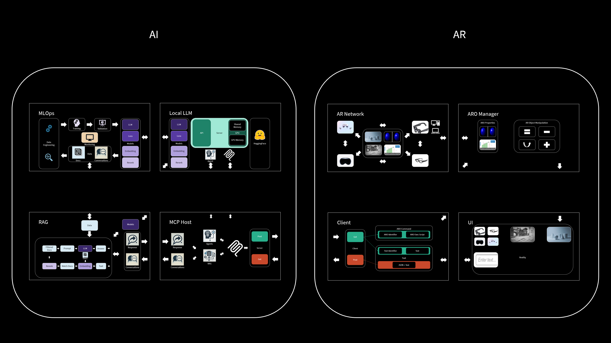

# AiArAssistant

**AiArAssistant** is a next-generation software framework that fuses **Artificial Intelligence (AI)** with **Augmented Reality (AR)** to create intelligent, interactive, and dynamic AR experiences.

This project empowers AR environments with advanced AI capabilities—ranging from contextual information retrieval to autonomous manipulation of virtual objects—by seamlessly integrating local Large Language Models (LLMs), Retrieval-Augmented Generation (RAG), and the MCP (Model Context Protocol) servers that intelligently routes user intents through embedded agents, all while maintaining real-time performance across AR platforms.

## ✨ Key Features

- **Intelligent AR Interaction**  
  Control and modify virtual 3D objects in AR using natural language commands.

- **MCP Server with Agent Routing**  
  The **MCP (Model Context Protocol) server** houses the Agent system to interpret, classify, and route user intents to the most suitable AI modules—enabling seamless orchestration of tasks and workflows.

- **RAG-Enhanced Knowledge**  
  Retrieve and generate contextually accurate responses from personal or domain-specific knowledge bases using Retrieval-Augmented Generation.

- **Modular MLOps + LoRA**  
  Fine-tune and manage models locally with Hugging Face, GPU acceleration, and modular components for training, embedding, and ranking.

- **Cross-Device AR Compatibility**  
  Works with a variety of AR glasses and devices, enabling portability and scalability.

## 🧠 Architecture Overview

The system is divided into two main domains:

### AI Modules
- **MLOps**: Handles training, validation, and fine-tuning (e.g., LoRA) of models.
- **Local LLM**: Runs inference using on-device LLMs powered by Hugging Face and shared memory for speed.
- **RAG**: Retrieves knowledge from documents and combines it with LLMs for grounded responses.
- **MCP Server**: A central coordination hub that includes:
  - **Agent**: Classifies user intents and selects the proper tools or modules to handle them.

### AR Modules
- **AR Network**: Connects AR devices like headsets and smart glasses.
- **ARO Manager**: Controls AR objects and manages their properties and behaviors.
- **AI Client**: Communicates with the AI backend (including the MCP server), sends and receives commands.
- **UI**: User interface for inputting commands and visualizing the AR environment.

---

> 🧩 **AiArAssistant** aims to bridge the gap between immersive environments and intelligent systems—giving users the power to not only explore AR, but to shape it with their words via the **MCP server**.
